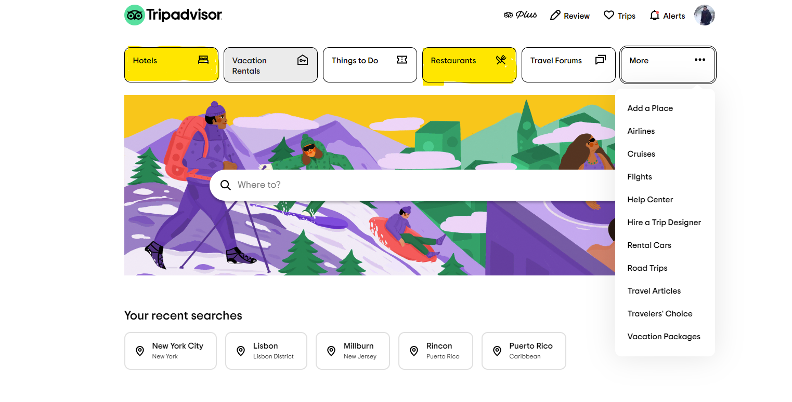
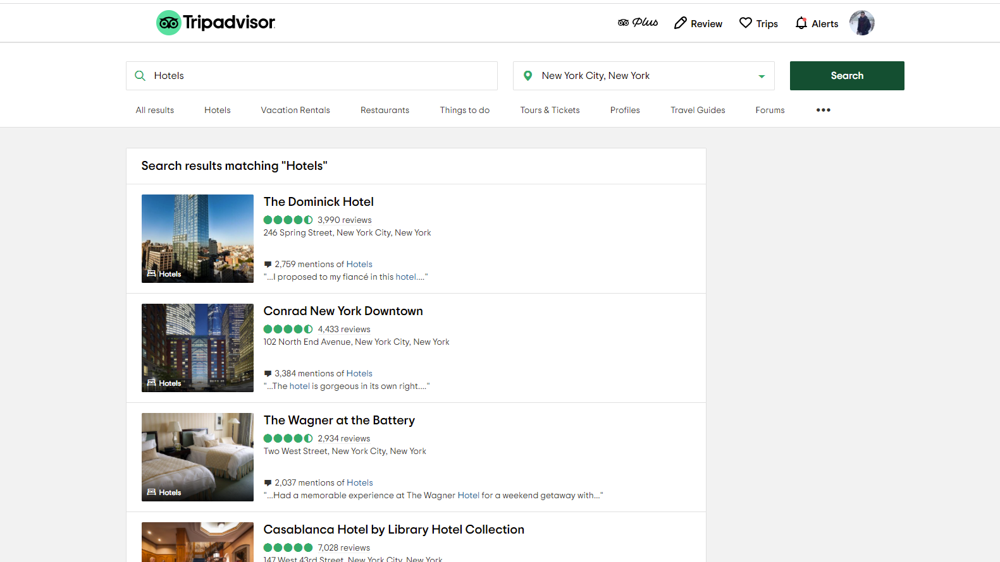
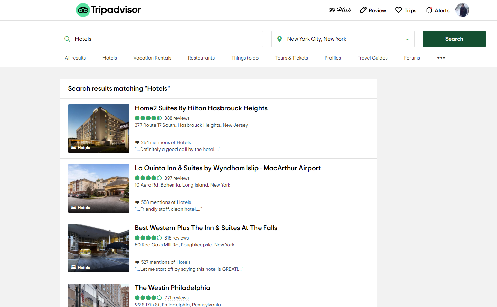
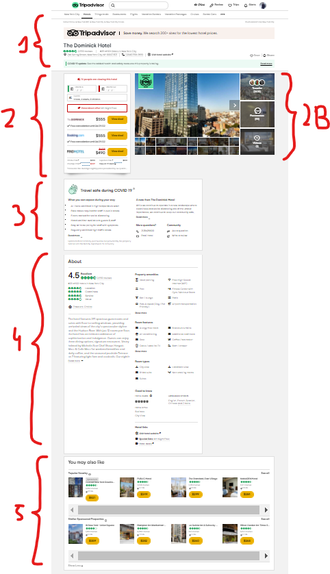
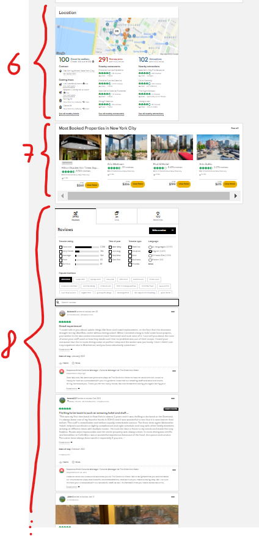
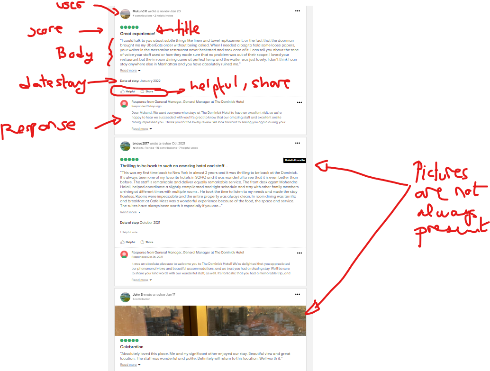
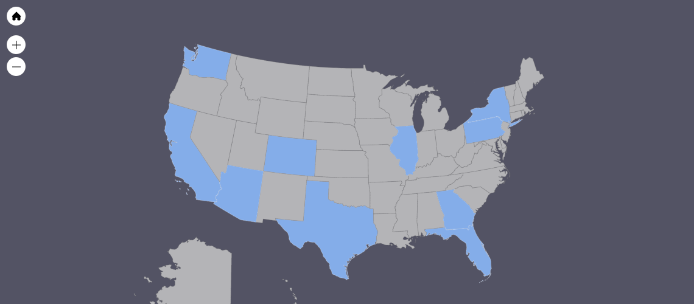

```{r setup, include=FALSE}
knitr::opts_chunk$set(echo = TRUE)
require(DT)
require(tidyverse)
require(DataExplorer)
require(webshot)
require(rvest)
require(digest)
require(jpeg)

```

## Purpose

The purpose of this Markdown is to provide a summary of the work performed during the time period in the title. With the objective to summarize the steps I'm taking towards finalizing this article. 

## Background

As indicated in the first draft of the article titled **Taking Pictures of your food may be useful after all: Analyzing Helpfulness of Pictorial Content in Experiential Online Reviews** we need to collect data from TripAdvisor and Yelp regarding Hotels and Restaurants to analyze if the elements present in pictures posted by users of these platforms provide helpfulness when new elements are present.  

For this we need to download not only the pictures but also several other elements present in the reviews of these businesses. We will provide below the approach used and the expected dataset we will collect by the end of the article. 

In this first week we downloaded reviews from Trip Advisor

## 1. Trip Advisor Website

Trip Advisor is an American online travel company that operates a website and mobile app with user-generated content. The website receieves significant traffic, 463 million average monthly unique visitors in 2019, and it was among top 10 travel apps in 26 countries as of January 2021. 

## 2. Data Available

The website is organized in 8 key categories out of which 'Hotels', 'Things to do', 'Forums' and 'Restaurants' recevie most traffic. For our article we focus on the categories *Hotels* and *Restaurants*



When accessing any of these two categories it will request you to provide a geographic location (city, country, state, etc...) and then it take you to a website with the list of top 1000 businesses in this category at the given location. 



The resulting page shows a list of hotel results with a highlight picture of the site, the name of the site, the score, number of reviews, and some other relevant information such as address, mentions, etc. 

The order of the results  seem to be a proprietary algorithm that sorts based on popularity (visits, and number of reviews), overall score (1 to 5) and geolocation. It seems the last varible by which the data is sorted is geolocation given that the latter pages could still be high in number of reviews and score, but are always further from the geolocation selected. 




If we go into any of these results we access the TripAdvisor business site. This is, for every business it will show a long website that contains 8 distinctive sections for which a business is described. 


Section 1 or header contains summary information about the biz. 
- Name of the site
- Score (1-5)
- Number of reviews
- Address and Website

Section 2 has information regarding booking a night in the business (only for hotels). There's a section 2B that is a summary of the pictures that can be found in the reviews. We will explain more about this in the method. 

Section 3 it's only a generic COVID-19 awareness information.

Section 4 is the 'About' section with several details regarding the total score and the individual factors that compose the total score of the business. Additionally contains information about the ammenities, Type of Hotel, and links.

Section 5 shows other hotels similar to this one.



Section 6 shows a convenience map with other landmarks, transportation and restaurants nearby.

Section 7 shows most popular hotels in the area

and finally section 8 contains information about reviews. 

Reviews section contains a lot of useful information and allows us to filter by specific parameters.
As usual we find User information at the top (including popularity, total helpfulness score at the top from all reviews).
Then relevant to the review is the Score, Title, Body and date of stay at the hotel. This information is present 100% of the time and it helps provide information regarding the stay. 

Then we find optional fields that may or may not show up such as the Helpful score (if other users up vote the score), Response from the business (owner or management), and Pictures provided by the author of the review. These may or may not show up. 




## 3. Data Collection Method

The biggest challenge is to find a way to list all the results and know what websites to go to in order to access the data. There isn't a sequential name of the websites to loop over the results. Instead we have to find a list of site urls from TripAdvisor and then download the relevant information about this business. 

For this I designed a two step process to download the data. Business List Scrapping and Business info Scrapping.

3.1 Business List Scrapping 

In order to retrieve a list of businesses in Hotels and Restaurants we need to always define the geolocation to search and what to search from. In terms of business search we can use the generic search term *Hotels* or *Restaurants* to find these type of businesses and then use the appropiate section from TripAdvisor to ensure the type of business is *Hotels* or *Restaurants*. This normally works well for Hotels, but it may miss some Restaurants that are considered *Bars*, *Bistro*, *Take-away*. Since we are scoping the work within between these two businesses we consider this shouldn't be a big issue.

Now to define the location, we are going to limit our search within the US. This is to keep the search more homogeneous and culturally similar among businesses compared. We decided to use a list of major 10 cities spread across the country to have a representative sample and increase the probability to find pictures within the results. This is because businesses big cities tend to receive more visitors and tend to have more complete reviews. 

The list of cities used are:

- New York City, NY
- Los Angeles, CA
- Seattle, WA
- Miami, FL
- Chicago, IL
- Houston, TX
- Phoenix, AZ
- Philadelphia, PA
- Denver, CO
- Atlanta, GA



This search of Category, City will provide coverage of most important locations for Restaurants and Hotels. In total we collected 20,000 businesses from TripAdvisor with the Address and other information. 


3.2 Business Info Scrapping 

When accessing a TripAdvisor Business site we have we have several distinct sections from which we can extract information. We are mostly interested in the reviews section. There's also a site to extract images but the format is complex to link a picture with a review (Section 2B). Instead we can loop over the reviews section and extract images after we have the image url. 

Each Review page has 5 reviews that are presented chronologically. For every business we have to load the HTML content information and make our way backwards in time to extract more reviews. Some sites have several thousands of reviews which makes the scrapping process too long to download in full. Instead we are going to download a subset of the 100 most recent review pages. This is the equivalent of downloading 500 reviews per business. Logically, when a site has less than 100 pages we will download all the information available for that site. In total we expect to download ~10,000,000 reviews.  We are currently finding 1 picture for every 50 reviews which means we will likely capture 200,000 pictures for our training set (Restaurants will likely contain more pictures that what we have found so far). We may reduce this amount depending on the analysis needs.

To speed up the process and avoid repeating url loading, we scrape the full HTML site for each website we visit. We then extract the relevant information from the stored HTML. 

3.2.1 Extracting Details about the business

It's important we capture information about the business we are analyzing in case we need to change the control variables in the future. For this we download the 'About' information (Section 4) where we can find details such as overll scores and other info (Location, Cleanliness, Service, Value). This could come in handy as we may find that pictures only provide information related to these variables. We can get this info also regarding the reviews. 

Additionally we will capture all the data from the amenities and the site information (number of stars in the hotel, or restaurant styles, price range). We only download this information once for every business so we will have 20,000 'About' descriptions available. 


3.2.2 Extracting Consistent Review items 

Every review must have a minimum information which is :
- User information: Name, Time the review was wrote, location of the user, number of contributions, Helpful votes total
- Review Information: Score, Title, Body, Time of Stay* (Since 2018)

All this information is at the review level and will always be captured. 

3.2.3 Extracting Inconsistent Review Items (Helpfulness, Pictures, Sub-category Scores) 

On the other hand there's inconsistent items that may show up or not on a review. These are important because the scrapping process is different
- Helpfulness: Number of Upvotes from readers considering this review as valuable or useful about the hotel to stay
- Pictures: Users sometimes provide pictures about the business. This could be featuring anything in the hotel (Views, Interiors, common areas, dishes, etc.). Not all reviews will have pictures. Additionally pictures can have Number of Likes. Which may or may not be useful. TODO: I'm trying to define how to download this information in the process-flow
- Sub-category scores: this values the sub-categories of Location, Cleanliness, Service, Value. This is not always provided but it may be interesting in the long term or for other analyses. 


4.1 Scrapping Tool: RSelenium & Rvest

4.1.1 RSelenium

We are using Rselenium Package in R to navigate through TripAdvisor websites. We automate Firefox browser navigation to mimic a regular user navigating through the websites. While this package could be incosistent due to load times and webtraffic we created several scripts to avoid this problems, such as TryCatch, System Sleep and Resume processes. Rselenium allows to interact with Java which for rvest is not possible since it only downloads HTML information. 

For more information visit [RSelenium](https://github.com/ropensci/RSelenium)


4.1.2 Rvest

Rvest is a headless scrapping package that allows to quickly download HTML directly. Because TripAdvisor is heavy in terms of Java we only use Rvest to extract information from the downloaded html sites. We 

For more information visit [rvest](https://rvest.tidyverse.org/index.html)


4.1.3 Sample output data: Business List Scrapping

We have collected the data for the list of sites in TripAdvisor. We store one unique table with all the url's for every Category (Hotel, Restaurant) and City combination. The data is stored in the DATA folder

```{r List_Scrap}
## List of files downloaded
list.files(path = "~/repos/PictureHelpfulness_API/DATA") %>% dplyr::tibble(List_urls = .) %>% DT::datatable()

```

We can also see the data that is stored in each of these files. 

```{r Info_list}

rds <- list.files(path = "~/repos/PictureHelpfulness_API/DATA",full.names = TRUE)[5]
data <- readRDS(rds) 
plot_str(data)
```

If we zoom into the url info we can see the category, the city and the query used to find the Business results

```{r zoom1}

## First info data is about the search query used
data[,1:3]

```
Then if we zoom into the column 4, we have information about all the different query searches. Column 4 contains all the urls of businesses in a given page of the search query. In the snapshot below we can see the urls for every query and the page in which the list was found. Every page has 30 urls that we download. 

```{r zoom2}

## First info data is about the search query used
data %>% head(2) %>% str()

```

4.1.4 Sample Output data: Business Info Scrapping 

We have initiated the download of all the reviews. At the time of this writing we collected over 17,450 reviews for Hotels in New York. 
The data contains all the information we explained. In section 3.2. 

First we will show the progress data that tracks where do we stand so far with the scrapping process. This is a table that contains the location of every html (5 reviews per html) for every business. Each file is stored in the folder SAVE and the file name represents the encryption (hash) of every business origin url (first url in the site). 

```{r urls}
## List of files downloaded
list.files(path = "~/repos/PictureHelpfulness_API/SAVE") %>% dplyr::tibble(List_urls = .) %>% DT::datatable()

```
If we get into each of these files we find that 

```{r zoom_save_file}

### within each file
rds2 <- list.files(path = "~/repos/PictureHelpfulness_API/SAVE",full.names = TRUE)[1]
data <- readRDS(rds2) 
D <- bind_rows(data) 
plot_str(D)

```
the root has the hash name of the business and within each business there are multiple list of reviews called tb, and a second set with the page location of each list of reviews. 

Tb contains the category and city of the business. Then it has the url where the reviews where collected (varying by page) and where is that html stored (file). With this we can easily locate the html for processing.

```{r zoom_1_r}

D$tb %>% bind_rows() %>% DT::datatable()

```
We can see the HTML downloaded 

```{r zoom_2_r}

rds <- D$tb %>% bind_rows() %>% pull(file) %>% tail(1) 
c_url <- D$tb %>% bind_rows() %>% pull(url) %>% head(1) 
html <- rvest::read_html(readRDS(rds))
# html


```

From here we can extract all the data we need

```{r data_get}

f_2_3_saveReviews <- function(html,c_url){
  # # navigate

    html %>% 
      html_elements(xpath = ".//div[contains(@class,'cWwQK MC R2 Gi z Z BB dXjiy')]") -> reviews 
    
    
    ## Scores 
    scores <- reviews %>% 
      html_elements(xpath = ".//div[@class='emWez F1']") %>% 
      html_elements(xpath = ".//span[contains(@class,ui_bubble_rating) and contains(@class,bubble_)]") %>% 
      html_attr("class") %>% 
      gsub(".*bubble_","",.) %>% as.numeric() %>% `/`(10)
    
    ## User
    users <- reviews %>% 
      html_elements(xpath = ".//a[@class='ui_header_link bPvDb']") %>% 
      html_text()
    
    ## Wrote on 
    date_w <- reviews %>% 
      html_elements(xpath = ".//div[@class='bcaHz']//child::span") %>% 
      html_text() %>% 
      gsub(".* wrote a review ","",.) 
    
    ## Title Description
    title_des <- reviews %>% 
      html_elements(xpath = ".//a[@class='fCitC']") %>% html_text()
    
    ## Description Body
    body_des <- reviews %>% 
      html_elements(xpath = ".//q[@class='XllAv H4 _a']") %>% html_text()
    
    ## Pictures
    Pictures <- list()
    for(i in 1:length(reviews)){
      # i <- 1
      urls_pics <- reviews %>% `[`(i) %>%  
        html_elements(xpath = ".//div[contains(@class,'faRsf _T')]") %>% 
        html_elements(xpath = ".//img[@class='bMGfJ _Q t _U s l bnegk']") %>% 
        html_attr('src') %>% gsub("jpg.*","jpg?w=2400&h=-1&s=1",.) 
      

      if(length(urls_pics) == 0){Pictures[[i]] <- NA}else{
      Pictures[[i]] <- urls_pics %>% purrr::map_df(.x = ., 
                                   ~dplyr::tribble(~url,~loc,~name,
                                                  .x,
                                                  f_0_3_PicDest(.x),
                                                  digest::digest(.x,algo = "md5"))
      )
      
      downs <- urls_pics %>% 
        purrr::map(.x = ., 
                   ~download.file(.x,f_0_3_PicDest(.x),mode = "wb")) %>% unlist()
        
      Pictures[[i]] %>% add_column(downloads = downs)  
      }
      
    } 
    
    
    ## Helpful
    Helpful <- list()
    for(i in 1:length(reviews)){
      # i <- 1
    Helpful[[i]] <- reviews %>% `[`(i) %>%  
      html_elements(xpath = ".//span[@class='ekLsQ S2 H2 Ch bzShB']") %>% 
      html_text() %>% 
      gsub(" Helpful vo.*","",.) %>% ifelse(length(.)==0,0,.) %>% as.numeric()
    } 
    Helpful <- Helpful %>% unlist()
    
    
    ## Stay
    Stay <- list()
    for(i in 1:length(reviews)){
      # i <- 1
      Stay[[i]] <- reviews %>% `[`(i) %>%  
        html_elements(xpath = ".//span[@class='euPKI _R Me S4 H3']") %>% 
        html_text() %>% 
        gsub("Data of stay:","",.) 
    } 
    Stay <- Stay %>% unlist()
    
    
    tb <- dplyr::tibble(user = users, title = title_des, 
                  body = body_des, score = scores, date_w = date_w,
                  pictures = Pictures, helpful = Helpful, 
                  stay = Stay, url = c_url, uid = digest(paste0(users,title_des,body_des,date_w)))
    
    

    
  
  
  return(tb)
}

f_2_3_saveReviews(html,c_url) 


```

Finally we can look at some of the pictures that were downloaded


5. Next Steps
- Finalize download images 
- Clean dataset and start analyzing images with methodology in paper
- Start analysis see if model works for 1-2 cities

- Finalize download of data (3-4 cities)
- After that start downloading data from Yelp


